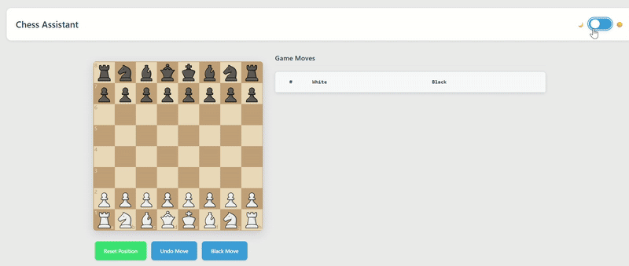

# Chess Assist

A modern, modular chess assistant web application built with ES2024 standards. It offers a clean, responsive interface for playing chess against an AI and solving a unique "King Escape" puzzle.



🎮 **[Play Online](https://rjj18.github.io/chess_assist)**

## Features

- 🎯 **Interactive Chess Board**: Visual drag-and-drop interface with coordinates.
- 🤖 **AI Opponent**: Play against an automated black player in a standard chess game.
- 🧩 **King Escape Mode**: A unique puzzle where you must guide the white king to safety (the 8th rank) while avoiding black's pieces.
- 📝 **Live Move Notation**: Real-time display of moves in standard algebraic notation for both game modes.
- 🎨 **Theme Toggle**: Switch between light and dark modes for comfortable viewing.
- 📱 **Responsive Design**: Works seamlessly on desktop and mobile devices.
- 🔄 **Game Controls**: Reset the game or puzzle, undo moves (in standard mode), and force the AI to move.
- ⚡ **Modern Architecture**: Built with modular ES2024 JavaScript, running directly in the browser with no build process required.

## Game Modes

### 1. Play Against AI
A standard game of chess where you play as white against an AI opponent playing as black.

### 2. King Escape Mode
A puzzle mode where the board is set up with a white king on e1 and a few black pieces. The goal is to move the king to any square on the 8th rank without being captured.

### 3. Pawn Race Mode
A fast-paced mode where you race your pawns to the other side of the board. The first player to get a pawn to the opposite end wins. Now fully implemented!

### 4. Lone Knight Mode
A puzzle mode where you control a single white knight that starts on one of the board's edges (a1-a8, h1, h8). Your goal is to capture all 8 black pawns scattered across the board using only knight moves. The game calculates the optimal number of moves needed and challenges you to match or beat that target.

## Quick Start

### Option 1: Play Online (Recommended)
Simply visit: [https://rjj18.github.io/chess_assist](https://rjj18.github.io/chess_assist)

### Option 2: Run Locally

1.  **Clone the repository**
    ```bash
    git clone https://github.com/your-username/chess-assist.git
    cd chess-assist
    ```

2.  **Serve the application**

    **With Python (recommended):**
    ```bash
    # Python 3
    python -m http.server 8000
    # or
    npm start
    ```

    **With Node.js:**
    ```bash
    npx serve .
    ```

    **With any other static server:**
    ```bash
    # Live Server extension in VS Code
    # or any static file server
    ```

3.  **Open your browser**
    ```
    http://localhost:8000
    ```

## GitHub Pages Deployment

This project is ready for GitHub Pages deployment:

1.  **Fork or clone** this repository to your GitHub account.
2.  **Enable GitHub Pages** in repository settings:
    -   Go to Settings → Pages
    -   Source: Deploy from a branch
    -   Branch: main / (root)
3.  **Your chess app** will be available at: `https://your-username.github.io/chess-assist/`

### Automatic Deployment

The project includes a GitHub Actions workflow that automatically deploys to GitHub Pages when you push to the main branch.

## Project Structure

```
chess-assist/
├── index.html                  # Home page with game mode selection
├── play.html                   # Standard chess game
├── pawn-race.html              # Pawn Race mode
├── escape.html                 # King Escape puzzle
├── modules/play.js             # Main script for standard game (was script.js)
├── styles.css                  # Application styles
├── demo.gif                    # Demo animation
├── modules/                    # ES2024 modules (game logic, controllers, etc)
│   ├── BaseGameController.js
│   ├── GameController.js
│   ├── KingEscapeGameController.js
│   ├── PawnRaceGameController.js
│   ├── BoardManager.js
│   ├── UIController.js
│   ├── MovesTableController.js
│   ├── BaseMovesTableController.js
│   ├── PlayerController.js
│   ├── HumanPlayerController.js
│   ├── AIPlayerController.js
│   ├── FenGenerator.js
│   ├── KingEscapeFenGenerator.js
│   ├── PawnRaceFenGenerator.js
│   ├── ...
├── package.json                # Project configuration
├── .github/workflows/          # GitHub Actions for auto-deployment
│   └── deploy.yml
└── cm-chessboard-master/       # Chess board library (external)
```


## Technical Details

-   **ES2024 Standards**: Uses modern JavaScript features and ES modules.
-   **No Build Process**: Runs directly in the browser without compilation.
-   **Modular & Extensible Architecture**: Clean separation of concerns with ES modules for different parts of the application (game logic, UI, etc.).
-   **Dependency Injection**: Controllers and logic are injected for flexibility and testability.
-   **Extensible Game Modes**: Easily add new modes by extending base controllers and generators.
-   **CDN Dependencies**: Uses chess.mjs from a CDN for chess logic.
-   **Static Hosting**: Compatible with any static file server.

## Browser Compatibility

-   ✅ Chrome 91+
-   ✅ Firefox 89+
-   ✅ Safari 15+
-   ✅ Edge 91+

## Dependencies

-   [cm-chessboard](https://github.com/shaack/cm-chessboard) - Interactive chess board
-   [chess.mjs](https://github.com/jhlywa/chess.js) - Chess game logic (via CDN)

## Contributing

1.  Fork the repository.
2.  Create a feature branch: `git checkout -b feature-name`
3.  Commit your changes: `git commit -am 'Add some feature'`
4.  Push to the branch: `git push origin feature-name`
5.  Submit a pull request.

## License

This project is licensed under the MIT License - see the LICENSE file for details.

## Acknowledgments

-   Chess board UI powered by [cm-chessboard](https://github.com/shaack/cm-chessboard)
-   Chess logic powered by [chess.js](https://github.com/jhlywa/chess.js)

---

**Enjoy playing chess!** 🎉♟️
