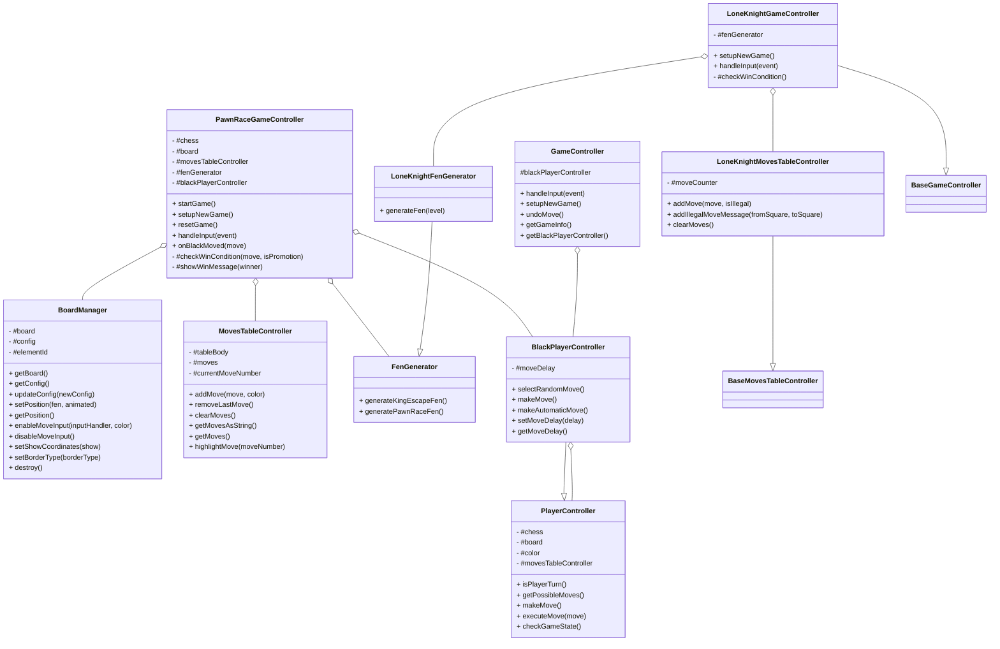

```mermaid
classDiagram
    class PawnRaceGameController {
        - #chess
        - #board
        - #movesTableController
        - #fenGenerator
        - #blackPlayerController
        + startGame()
        + setupNewGame()
        + resetGame()
        + handleInput(event)
        + onBlackMoved(move)
        - #checkWinCondition(move, isPromotion)
        - #showWinMessage(winner)
    }

    class BoardManager {
        - #board
        - #config
        - #elementId
        + getBoard()
        + getConfig()
        + updateConfig(newConfig)
        + setPosition(fen, animated)
        + getPosition()
        + enableMoveInput(inputHandler, color)
        + disableMoveInput()
        + setShowCoordinates(show)
        + setBorderType(borderType)
        + destroy()
    }

    class MovesTableController {
        - #tableBody
        - #moves
        - #currentMoveNumber
        + addMove(move, color)
        + removeLastMove()
        + clearMoves()
        + getMovesAsString()
        + getMoves()
        + highlightMove(moveNumber)
    }

    class FenGenerator {
        + generateKingEscapeFen()
        + generatePawnRaceFen()
    }

    class PlayerController {
        - #chess
        - #board
        - #color
        - #movesTableController
        + isPlayerTurn()
        + getPossibleMoves()
        + makeMove()
        + executeMove(move)
        + checkGameState()
    }

    class BlackPlayerController {
        - #moveDelay
        + selectRandomMove()
        + makeMove()
        + makeAutomaticMove()
        + setMoveDelay(delay)
        + getMoveDelay()
    }

    class GameController {
        #blackPlayerController
        + handleInput(event)
        + setupNewGame()
        + undoMove()
        + getGameInfo()
        + getBlackPlayerController()
    }

    class LoneKnightGameController {
        - #fenGenerator
        + setupNewGame()
        + handleInput(event)
        - #checkWinCondition()
    }

    class LoneKnightMovesTableController {
        - #moveCounter
        + addMove(move, isIllegal)
        + addIllegalMoveMessage(fromSquare, toSquare)
        + clearMoves()
    }

    class LoneKnightFenGenerator {
        + generateFen(level)
    }

    BlackPlayerController --|> PlayerController
    PawnRaceGameController o-- BoardManager
    PawnRaceGameController o-- MovesTableController
    PawnRaceGameController o-- FenGenerator
    PawnRaceGameController o-- BlackPlayerController
    GameController o-- BlackPlayerController
    BlackPlayerController o-- PlayerController
    LoneKnightGameController --|> BaseGameController
    LoneKnightGameController o-- LoneKnightMovesTableController
    LoneKnightGameController o-- LoneKnightFenGenerator
    LoneKnightMovesTableController --|> BaseMovesTableController
    LoneKnightFenGenerator --|> FenGenerator
```
